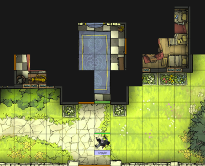
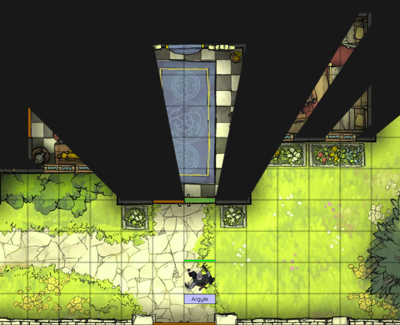
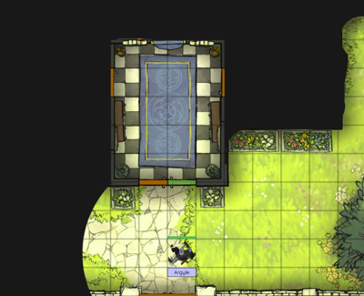
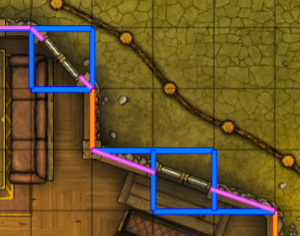

# Creating an adventure
All that is needed to create an adventure, can be found in the Dungeon Master's Vault. To enter the Dungeon Master's Vault, click on the DM's Vault link in the menu bar. The Dungeon Master's Vault also has all that is needed for user and website administration. A user needs the Dungeon Master role to access the Dungeon Master's Vault. The adventure creation section has the following options:

## Token administration
This page allows you to add monster, NPC and object tokens to Cauldron. Be aware that tokes are available for every adventure created within your group. Make sure that all Dungeon Masters in your group only make changes to an existing token if all other Dungeon Masters agree. Otherwise, a change made to a token could affect another Dungeon Master's adventure!

When you upload an image for a token, make sure that it's a top view image. When it's a token for a monster or NPC, make sure that it's looking down. Otherwise, setting the orientation for that token during map building won't work properly.

Here are a few resources with free tokens to get you started:

- Tokens by Jan Loos
- Forgotten Adventures tokens
- Tokens by Devin Night
- Tokens at Pinterest

## Resource administration
Each adventure and map uses multiple resources, which can be stored within Cauldron. The following directories are available by default:

- audio: Here you can store audio files that can be played during a game session. Audio files can be played on command or via a zone script.
- brushes:: Here you can store your own tileable textures that can be used to paint the map background.
- characters: Cauldron uses this directory for player character tokens and character sheets. Only change its content if you know what you're doing.
- collectables: Cauldron uses this directory for collectables. Only change its content if you know what you're doing.
- effects: Here you can store your own icons that can be used for map effects. A Dungeon Master can create a map effect by right clicking the map and selecting Create effect.
- maps: Here you can store map background images. You can create a subdirectory per adventure if you like.
- pictures: Here you can upload pictures you want to show to your players during a session. To do so, select 'Pictures' from the menu during a session.
- tokens: Cauldron uses this directory for monster, NPC and object tokens. Only change its content if you know what you're doing.

You can link to a resource via `/resources/<filename>`. You can use the breadcrumbs above the resource browser to find the path to your resource file. Be aware that there is a limit to the amount of resources you can store in Cauldron. But since Cauldron is web based, you can also use resources from other servers.

## Adventure administration
Before you can build maps, you need to create an adventure first. The background image and introduction story are shown in the main menu screen. You can link to an external background image or upload one to, for example, the root of the resource directory in the Resource Administration.

## Map administration
Creating maps is the most important part of the adventure building. In Cauldron, you can use images and videos as a map background. They can be stored in Cauldron via Resource Administration, but you can also use resources from other servers. A background audio is played repeatedly when that map is active during a game session. A player controls its character via the keyboard, but optionally it can drag it via the mouse. When a player drags its character via the mouse, doors, walls and windows that would otherwise block the character's path, will be ignored. The default Fog of War distance only applies to the dark / night types and the manually reveal type (initial visible area around characters). During a game session, the map notes are available to the Dungeon Master via the 'DM notes' button at the top of the screen.

Cauldron offers multiple types of Fog of War: cell, real and manually reveal. Cell is a cell based Fog of War, where a cell is completely clear or covered. Real is a more realistic looking Fog of War type, but requires more computing power than the cell type. Both cell and real type have a day / illuminated and a night / dark modus. In the day / illuminated mode, a player can see as far as possible, where in the night / dark modus, sight is limited to a defined distance. The last type is manually reveal, where the Dungeon Master erases the Fog of War at his own discretion in a paint-like way.

`Cell`

`Real`

`Manually reveal`

In the map building screen, right click on the map to create blinders, doors, lights, walls, windows and zones. You can add tokens by dragging them from your token collection on the right side of the screen onto the map. Right click on a token to change its settings. When you duplicate a token, the new token will have the same hit points, armor class, rotation and presence. Lowering a token allows you to access another token underneath it.

`Blinders and windows`

Doors, walls and windows can be used to block a player's path and or vision. They are all placed at the edges of the grid cells (hold the CTRL button to place consecutive walls or windows). Sometimes, a wall on a map isn't on a cell's edge. This is where you use blinders. Blinders can be placed anywhere on the map (hold CTRL to create consecutive blinders and hold the ALT button to get off the edges), but they only block vision. Use a combination of blinders and windows to have a correct path and vision blocking on such maps. In the next example, the walls are orange, the windows are blue and the blinders are purple. Cauldron remembers the last construct you've created. So, while you're not creating a construct and you click on the map while holding the CTRL key, you start creating a new construct of that last type. Pressing the Escape key cancels any construct you're currently creating.

A door can be opened (green) and closed (brown) by the Dungeon Master. A secret (yellow) door can't be seen by players. A barred (block pattern) door is transparent.

A zone is mainly a visual marker on the map, but you can use a non-transparent zone to cover an area for players. A zone is always at least a bit transparent for a Dungeon Master. A 100% transparent zone is also always a bit visible for the Dungeon Master. You can automate several simple tasks via a script, which can be attached to a zone. What a script can do, is explained via the help button in the script editing window.

Here are a few resources with free maps to get you started:

- [Lost Atlas,](https://lostatlas.co/) a battle map search engine
- [Pixelastic,](https://gamemaster.pixelastic.com/maps/) another battle map search engine
- [Reddit Battle Maps](https://www.reddit.com/r/battlemaps/)
- [Search via Startpage](https://www.startpage.com/sp/search?query=pinterest+D%26D+battlemap&cat=pics)
- [Dan the Map Man](https://www.patreon.com/DantheMapMan)
- [Forgotten Adventures](https://www.forgotten-adventures.net/battlemaps/)
- [Tom Cartos,](https://www.tomcartos.com/map-gallery) [Master Post - Free](https://www.patreon.com/posts/54516413)
- [Dice Grimorium](https://dicegrimorium.com/free-rpg-map-library/)
- [Maps from Witcher 3](https://imgur.com/a/Hyy9l)
- [More maps from Witcher 3](https://imgur.com/a/Ezc6b)
 
Nice tools to create your own maps are [Dungeondraft](https://dungeondraft.net/) and [FlowScape](https://pixelforest.itch.io/flowscape).

## Collectable administration
Throughout the maps, you can hide items for players to find. Here you can create those items. Items can only be placed 'inside' a token that is already placed on a map. In Map Administration, right click a token on a map and select 'Assign collectable' to place a collectable inside that token.

A player can find an item when its character is nearby the containing token and selects 'View' via a right click on that token. An item that is found, is shown in every player's inventory. When an item is found, you can optionally let Cauldron automatically hide the containing token.

## Player administration
The last step before you can start running your adventure, is to add player characters to your adventure. Before you can do so, make sure your players have created their character. Characters will be placed on the maps at or near the 'Player start' marker. A player's character can only be active in one adventure at a time.

- Go to [Manual](../README.md)