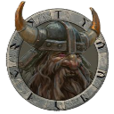
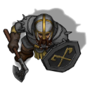

# Creating a character
Players have to create their own character. Click on 'Characters' in the menu bar to go to the character page. Here you can add and edit your characters. Cauldron isn't a tool for complete character creation. So, besides the character name and an icon, you only need to enter the values that are needed to do D20 battle calculations.

When selecting a token image, you can use a top-down image or a portrait. When using a top-down image, make sure that it's looking down. Specify the right token type, as this defines the way you move your character via the keyboard, which will be explained in the next section.

When you've created a character, you can add alternate tokens for that character, by clicking on the small face icon in the upper right corner of your character panel. You can use this, for example, for characters with shape changing abilities. Alternate tokens can be normal (1×1), large (2×2) or huge (3×3).

  
portrait

  
top-down

# D&D Beyond browser extension
When you have a character in D&D Beyond that you would like to use while playing an adventure in Cauldron VTT, you can use [this browser extension](https://github.com/Jamster3000/cauldron20). For support, go to the browser extension's Github page and visit the Wiki or Issues page. You can also ask for help at the Cauldron VTT Discord server.

- Go to [Manual](../README.md)